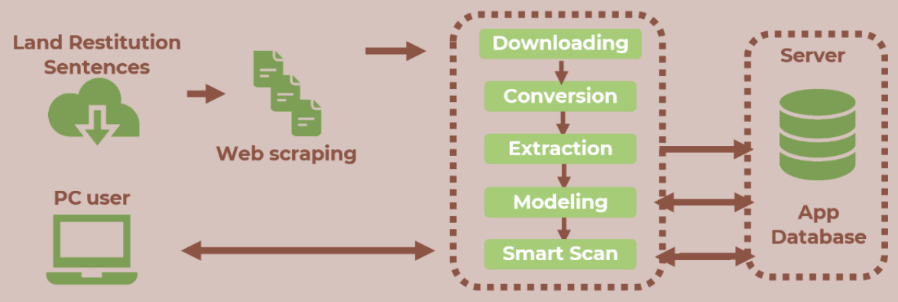
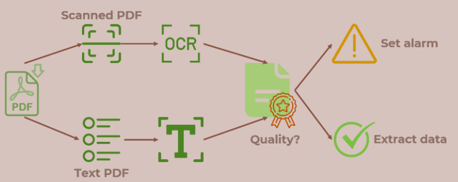
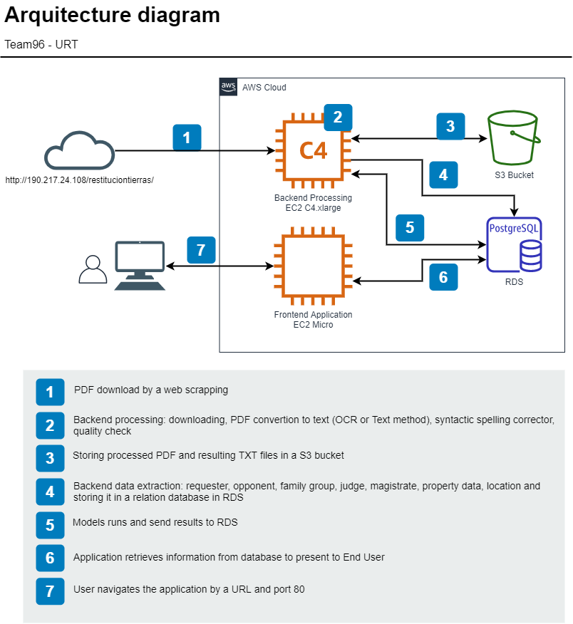
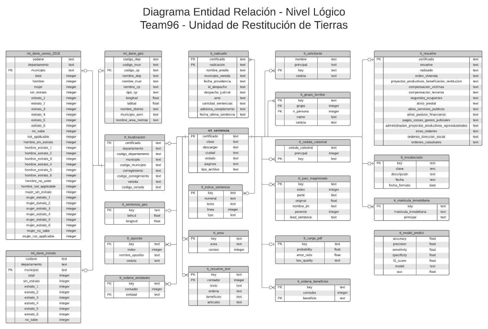
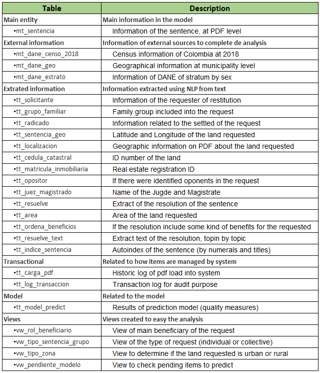

# Ground Truth

**Ground Truth** was born due to the need to reduce the lag in the systematization of sentences to do a right follow-up to the orders for *The Special Administrative Unit for the Management of Restitution of Dispossessed Lands* (Unidad Administrativa Especial de Gestión de Restitución de Tierras Despojadas - UAEGRTD) . They claimed that by 2020, they are delay in systematizing around 900 sentences from years between 2013 and 2015.

## Install
The installation process can be found in the repository file "Guía de instalación SmartScan Ubuntu 1804 LTS.docx" in Spanish.

## Elements
The elements of our **Ground Truth** solution are:

### Input
- PDF metadata obtained through a web scraping process from URT repositories.

### Back-end
1. Downloading the PDF files
2. Converting the PDF files
3. Extracting the information from the converted files
4. Modeling the extracted data

### Output
- Dashboard with the Smart Scan interface

### Content

1. <b>Backend</b>:

1.1 <b>Folders</b>
- <i>Data</i>: where fixed data is stored
- <i>Tmp</i>: here the documents in process are downloaded (subfolder /data), converted to text using ocr or txt library (subfolders /text and /ocr), temporal images of ocr (subfolder /images) and temporal output from some subprocesses (subfolder /output)
- <i>Done</i>: finished documents, both the pdf downloaded from web scrapping and the txt files convertes (ocr or text techniques)

1.2 <b>Scripts</b>
- <i>common.py</i>: configuration variables through the process, like paths, file names, sql string, dictionary, url source, etc
- <i>1_web_scraping.py</i>: explore the url source looking for new sentences published
- <i>2_download.py</i>: makes the download of the new pdf files and keep them locally to process later
- <i>3_pdf_conversion.py</i>: this step converts the file to txt using OCR or TXT conversion techniques (calculated the quality of the conversion) and keep the result in tmp folder
- <i>4_table_extraction.py</i>: this is the main extraction program, it retrieves from the text (using NLP) the following information: requested, family group, settled ID, latitude and longitude of the land, town, state and municipality of the land, land ID, real estate registration, resolution items, entities involved into judge orders and benefits for the requester
- <i>5_oppositor_extraction.py</i>: it extracts from the text if there are some opponent to the request, and the judge and/or magistrate how dictated the resolution
- <i>6_full_index_extraction.py</i>: this one generates automatically an index of the PDF, looking for titles, subtitles and following the number conventions of the texts. It is also sent to database to make it available to end user
- <i>7_solution_extraction.py</i>: it is an extraction of the text focused only to the resolution, where every item is extracted to validate if an entity is involved in the item and which benefits were given to the requester
- <i>8_solution_index_extraction.py</i>: focused only in the subitems of the resolution part. Stored into database to make it available to end user
- <i>9_prediction_model.py</i>: it used the previously models to predict the 13 replies to the business. These replies (YES/NO) are shown to users in the application
- <i>model_setup_training.py</i>: this part of the process was only used in the development of the solution, and it persists the models to future usage in production. Model are stored as pickled object into folder data

2. <b>Frontend</b>: The full front end of our solution, it contains the standard folders like apps, assets, datasets and images, and also the index.py as the starting script of the application.

### How it works?

In general, the below flow explain the main features of the solution 

Also, the conversion process works in this way: 

### How technically  it works?

See the below arquitecture to have a summary, but we invite you to see <a href="Technical Documentation for SmartScan.docx">this document</a>

Check also the ER model here (you can also open <a href="ER.png">ER model image</a> to zoom it): 

The table description is below: 

