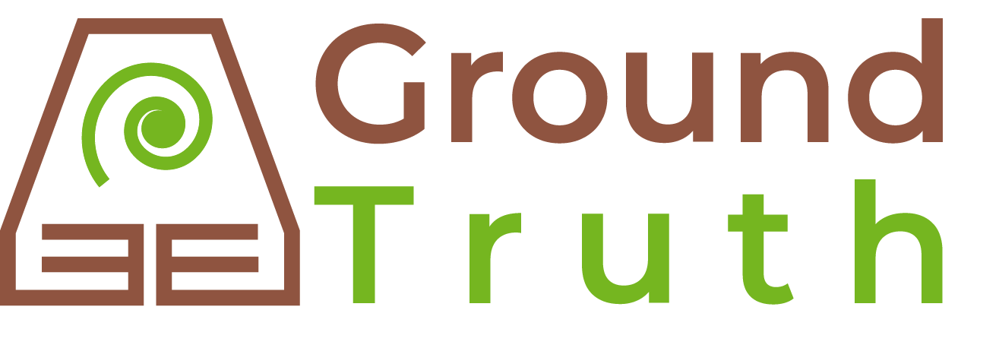

# Ground Truth

**Ground Truth** was born due to the need to reduce the lag in the systematization of sentences to do a right follow-up to the orders for *The Special Administrative Unit for the Management of Restitution of Dispossessed Lands* (Unidad Administrativa Especial de Gestión de Restitución de Tierras Despojadas - UAEGRTD) . They claimed that by 2020, they are delay in systematizing around 900 sentences from years between 2013 and 2015.

## Install
The installation process can be found in the repository file "Guía de instalación SmartScan Ubuntu 1804 LTS.docx" in Spanish.

## Elements
The elements of our **Ground Truth** solution are:

### Input
- PDF metadata obtained through a web scraping process from URT repositories.

### Back-end
1. Downloading the PDF files
2. Converting the PDF files
3. Extracting the information from the converted files
4. Modeling the extracted data

### Output
- Dashboard with the Smart Scan interface
